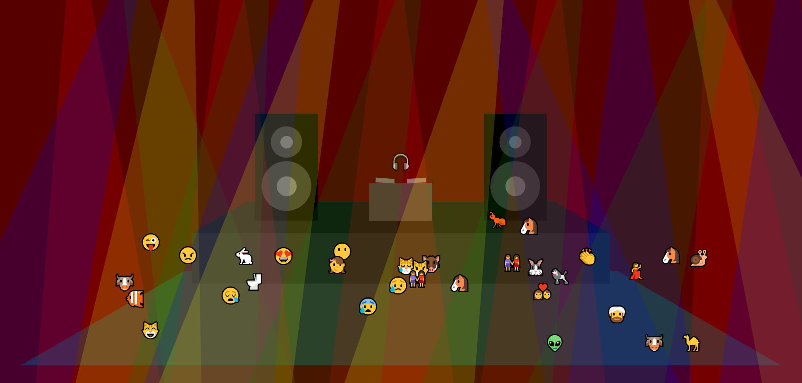

# Emoji Disco

Select a music file from your computer to get the party started

**You can use it [here](https://thischrisblack.github.io/emoji-disco/).**

This is my first of what I expect will be many experiments with the Web Audio API. It uses the dB levels of selected frequency bands to animate the dancers, the lights, the DJ, the turntables, and the speakers.

